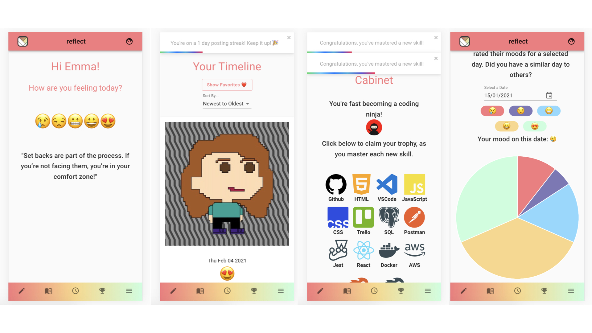

# Agile Avengers - Holistic Tracking App

- **Our Problem**: Bootcampers are disengaged with the current holistic documentation experience because google forms are not engaging, bootcampers don’t understand the value of documenting their SoC experience, or what happens to their reflections with no access to it when it’s sent.

- **Solution**: A storyboard where bootcampers can record their experiences and how they are feeling in a fun and engaging way. Bootcampers will be able to view their posts allowing them to be reflective, monitor their moods and celebrate their achievements. This will be a mobile app - PWA - bootcampers can use their phones rather than their laptop.

---

## Deployed App [here](https://reflectjournal.netlify.app/) - feel free to check it out 😀



---

## **Installation and Setup Instructions**

Clone down this repository. You will need node and npm installed globally on your machine.

1. Clone the repo from https://github.com/SchoolOfCode/front-end-final-project-agileavengers.git

```
git clone https://github.com/SchoolOfCode/front-end-final-project-agileavengers.git
```

2. Install any node modules (you will need node and npm installed globally on your machine):

```
npm install
```

3. Run the front-end server using:

```
npm run start
```

4. Visit the App at:

```
localhost:3000
```

5. To Run the Test Suite:

```
npm run test
```

---

## How to use the app and the user's journey.

1. Once you've opened the app you'll be taken to a log-in page. Please log in using either your google account or sign up using your email. This will create a user account on our database.

2. After logging in, please enter your Myers-Briggs personality type (_if you don't know this please check out https://www.16personalities.com/free-personality-test_) and the start date of your course.

3. You will then be directed to the emotions page where you select your mood for the day on a scale of 1 (terrible) to 5 (fantastic).

4. After entering your mood, you will be prompted to add a journal entry. If you don't have anything to add at the moment you can skip this step for now and come back to it later.

5. You will then be taken to your journal view page where you can see all your previous posts and moods. You're able to filter, favourite or delete your entries on this page.

6. The next tab on the app is a timeline page which corresponds with your course start date and is a visual progress bar of how far you've come since you began the course.

7. Following on from that we have the trophies page, this is where you can award yourself trophies depending on whether you've mastered a skill. This will help you keep an eye out of where you're strengths and weaknesses are as the course progresses.

8. On the right hand side of the navigation we have a drop-down with the following options:
   - Change your view to dark/light mode.
   - Edit your mood for the day.
   - Add a journal entry.
   - The stats page, you can see a graph of your moods throughout the course, this will help you keep an eye on your mental well-being also. If you've had a lot of bad days consequentially, maybe take a break on the weekend.
   - The users moods page - add desc...
   - Log out of your account.

---

## Tech used:

- PWA App made with React.
- Auth0 for authentication and user accounts.
- Cloudinary for multimedia hosting.
- Material-UI components for styling.

---

App by Agile Avengers✌️
